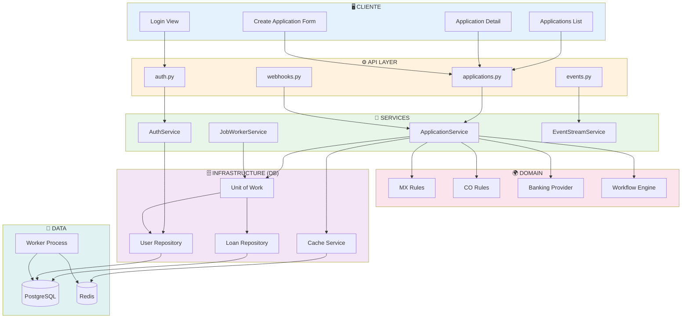

# Fintech Test

Sistema MVP para gestión de solicitudes de crédito en múltiples países, con validación de reglas por país, integración bancaria, procesamiento asíncrono y actualizaciones en tiempo real.

---

## Índice

- [Instalación Rápida](#instalación-rápida)
- [Stack Tecnológico](#stack-tecnológico)
- [Arquitectura](#arquitectura)
- [Modelo de Datos](#modelo-de-datos)
- [Decisiones Técnicas](#decisiones-técnicas)
- [Seguridad](#seguridad)
- [Escalabilidad](#escalabilidad)
- [Concurrencia, Colas y Webhooks](#concurrencia-colas-y-webhooks)

---

## Instalación Rápida

### Requisitos Previos

- Docker + Docker Compose
- Git


### Pasos

```bash
# 1. Clonar repositorio
git clone https://github.com/eduardocota2/fintech-test.git
cd fintech-test

# 2. Iniciar servicios
docker compose up --build -d

# 3. Ejecutar migraciones
docker compose up migrate

# 4. Acceder a la aplicación
# Frontend: http://localhost:3001
# API Docs: http://localhost:8001/docs
```

### Servicios Iniciados

| Servicio | URL | Descripción |
|----------|-----|-------------|
| Frontend | http://localhost:3001 | Interfaz Vue.js |
| API | http://localhost:8001 | FastAPI + docs automáticos |
| PostgreSQL | localhost:5434 | Base de datos |
| Redis | localhost:6379 | Caché |

### Makefile

```bash
make run          # Iniciar todo
make stop         # Detener servicios
make migrate      # Ejecutar migraciones
make test         # Ejecutar tests
make logs         # Ver logs
make deploy-k8s   # Desplegar en Kubernetes
```

---

## Stack tecnológico

| Capa | Tecnología | Versión |
|------|------------|---------|
| **Backend** | Python + FastAPI | 3.13 + 0.122 |
| **Frontend** | Vue.js 3 + TypeScript | 3.5.13 |
| **Base de Datos** | PostgreSQL | 16-alpine |
| **Caché** | Redis | 7-alpine |
| **ORM** | SQLAlchemy | 2.0.41 |
| **Auth** | JWT (python-jose) + bcrypt | 3.5.0 |
| **Migraciones** | Alembic | 1.16.4 |
| **Contenedores** | Docker + Compose | - |
| **Orquestación** | Kubernetes | - |

---

## Arquitectura

### Diseño en Capas

```
┌─────────────────────────────────────────┐
│  API Layer (FastAPI)                    │
│  - Validación de requests               │
│  - Autenticación JWT                    │
├─────────────────────────────────────────┤
│  Service Layer                          │
│  - ApplicationService                   │
│  - AuthService                          │
│  - JobWorkerService                     │
├─────────────────────────────────────────┤
│  Domain Layer                           │
│  - ScoringEngine (factores ponderados)  │
│  - CountryRuleService (MX/CO)           │
│  - Workflow State Machines              │
├─────────────────────────────────────────┤
│  Integration Layer                      │
│  - Banking Providers (mock)             │
│  - Webhook Client                       │
│  - Redis Cache                          │
├─────────────────────────────────────────┤
│  Data Access Layer                      │
│  - Repositories (Pattern)               │
│  - Unit of Work (Pattern)               │
└─────────────────────────────────────────┘
```

### Diagrama de componentes



### Patrones Implementados

- **Repository Pattern**: Un repositorio por entidad
- **Unit of Work**: Transacciones atómicas
- **Strategy Pattern**: Reglas por país vía registro
- **State Machine**: Transiciones de estados validadas
- **Factory Pattern**: Proveedores bancarios por país

---

## Modelo de Datos

### Diagrama de Entidades

```
┌─────────────┐     ┌──────────────────────┐     ┌──────────────┐
│    users    │────▶│  loan_applications   │◄────│    jobs      │
├─────────────┤ 1:N ├──────────────────────┤ 1:N ├──────────────┤
│ id (PK)     │     │ id (PK)              │     │ id (PK)      │
│ email       │     │ user_id (FK)         │     │ loan_id (FK) │
│ password    │     │ country (MX/CO)      │     │ job_type     │
│ is_admin    │     │ status               │     │ status       │
└─────────────┘     │ amount_requested     │     │ payload      │
                    │ monthly_income       │     └──────────────┘
                    │ document_id          │
                    └──────────────────────┘
                              │
              ┌───────────────┴───────────────┐
              ▼                               ▼
    ┌──────────────────┐          ┌──────────────────┐
    │   audit_logs     │          │  risk_decisions  │
    ├──────────────────┤          ├──────────────────┤
    │ id (PK)          │          │ id (PK)          │
    │ loan_id (FK)     │          │ loan_id (FK)     │
    │ action           │          │ score (0-1000)   │
    │ details (JSON)   │          │ factors (JSON)   │
    └──────────────────┘          └──────────────────┘
```

## Decisiones Técnicas

### 1. PostgreSQL como Cola de Jobs
Se utilizó PostgreSQL para gestionar los jobs para omitir el aumento de complejidad que traería utilizar alguna herramienta como RabbitMQ.

Se utilizó la opción 'FOR UPDATE SKIP LOCKED' para aumentar la concurrencia de los procesos en la BD, con esto se prepara para escalar en caso de que aumenten la cantidad de peticiones.

**Implementación**:
```python
# Concurrencia segura entre workers
stmt = (
    select(JobQueue)
    .where(JobQueue.status == JobStatus.PENDING)
    .with_for_update(skip_locked=True)
    .limit(1)
)
```

### 2. Motor de Scoring Configurable
Para la toma de decisiones se creó un sistema de scoring con factores ponderados que pueden ser configurables por país.
Este motor de scoring permite la configuración de las decisiones a tomar para la aceptación, revisión o rechazo de una solicitud por país.

Aquí se muestran algunos de los pesos que conforman el scoring. Para los casos de México y Colombia solo se modificaron los pesos ya que por ejemplo para Colombia se considera más la deuda que tiene el solicitante. Cada país tiene su propia configuración por lo que los factores y los pesos de cada país están separados.

NOTA: Para agilizar el desarrollo, se utilizaron valores estáticos dentro del código. Lo recomendable para la solución sería una estructura configurable por base de datos para desacoplar responsabilidades en caso que se requiera.

Debajo se muestran los pesos que se usaron:

**Factores MX**:
- deuda total vs ingresos mensuales: 30%
- Monto solicitado vs Ingresos mensuales: 25%
- score de crédito: 25%
- estabilidad de ingreso: 15%
- validación de documento: 5%

**Factores CO** (diferentes pesos):
- deuda total vs ingresos mensuales: 35% (mayor peso por regulación)
- Monto solicitado vs Ingresos mensuales: 25%
- score de crédito: 25%
- estabilidad de ingreso: 10%
- validación de documento: 5%

### 3. Triggers PostgreSQL para Webhooks
Se creó un trigger que encola un webhook cuando el status de una solicitud cambia a un estatus terminal (aprobada o rechazada).

### 4. Updates en tiempo real
Se utilizó Server-Sent Events para el manejo de la comunicación de tiempo real. La razón es que disminuye la complejidad de la implementación de Sockets y el caso de uso en particular en el que solo el servidor estará mandando eventos se ajusta bien para este requerimiento.

### 5. Simulación Bancaria Determinística
Para el manejo de entidades bancarias, se utilizó el patrón strategy para estructurar los bancos por país así como las reglas y su lógica de negocio. Para esta solución se utilizaron distintas estrategías para simular algunos casos requeridos para los flujos.

### 6. Caché
Para el manejo de caché, se implementó el guardado en caché en el endpoint de lista de aplicaciones ya que es el endpoint que más se utiliza actualemente.
La estrategia para invalidación que se utilizó fue por versionado, se guarda la información con una versión, si alguno de los endpoints (crear solicitud, actualizar solicitud) es utilizado, se incrementa la versión y se invalida el caché guardado en la versión anterior.

---

## Seguridad

### Autenticación JWT
Para la autenticación se utilizó JWT simple con el manejo de un campo "is_admin" para definir la autorización del usuario logueado.
Para la encriptación de la información sensible (passwords) se utilizó algoritmo HS256 sin embargo es recomendable incrementar la seguridad con alguna librería tipo bcrypt.

### Autorización

| Rol | Permisos |
|-----|----------|
| Usuario | CRUD propias solicitudes |
| Admin | Todo + cambio de estados |

### Manejo de PII (Personally Identifiable Information)
Para el manejo de PII se utilizaron distintas estrategias:
1. document_id: para documentos de integridad se utilizó enmascarado.
2. password: Se utilizó H256 que puede ser mejorado a bcrypt.
3. bank_account: aunque fue simulado, solo manejaba con los últimos 4 dígitos.
4. full_name: solo quedó visible para propietario y admins.

### Headers de Debug (DESARROLLO SOLAMENTE)
Se empleó una estrategia temporal para manejar el nivel de deuda de los solicitantes. Esto con la finalidad de aumentar el control en el resultado de las solicitudes.
Esta implementación consiste en definir el nivel de deuda (opción solo desarrollo) en el formulario de creación de solicitud de préstamo. Este valor se manda a través de la cabecera y es recibida por los flujos generales de cada país. Con esto podemos definir el nivel de deuda del solicitante de manera dinámica y controlada.

NOTA: esta funcionalidad solo compensa la falta de conexiones a entidades bancarias que nos puedan proporcionar esa información.
NOTA 2: La implementación está diseñada para ser desactivada en producción.

---

## Escalabilidad

### Estrategias para Millones de Solicitudes
Para el manejo de millones de solicitudes se utilizaron estas técnicas:
1. Particionamiento: agregar índices a los campos que más se procuran dentro de las consultas.
2. Filtros y paginación: Para consultas pesadas, se controla la cantidad que se puede transportar por medio de filtros y paginación.
3. Jobs: para los procesos asíncronos se utiliza FOR UPDATE SKIP LOCKED explicado previamente. También se puede dividir en múltiples workers por lo que puede crecer horizontalmente.
4. Caché: Para el manejo de solicitudes frecuentes, utilizamos caché para disminuir la carga de consultas a la base de datos.

Para un sistema más maduro podría implementarse sharding por país en caso de que la aplicación escale mucho.

Para un sistema más maduro

---

## Concurrencia, Colas y Webhooks

### Concurrencia
Para la concurrencia, se diseñó un worker que maneja los procesos principales.

Con el manejo de kubernetes, es posible crear múltiples workers que trabajen en paralelo y gracias al uso de SKIP LOCKED evita que 2 workers tomen el mismo job.

**Tipos de Jobs**:

| Tipo | Trigger | Acción |
|------|---------|--------|
| `RISK_EVALUATION` | Crear solicitud | Evaluar scoring, actualizar estado |
| `WEBHOOK_NOTIFICATION` | Trigger DB (status terminal) | POST a endpoint externo |

### Webhooks
Se implementó un webhook para mandar la información de las solicitudes cuando cambian de status.

**Trigger**: PostgreSQL trigger ejecuta automáticamente cuando status cambia a `approved` o `rejected`.

## Despliegue

### Docker Compose (Desarrollo/Pruebas)

```bash
docker compose up --build -d
```

Servicios: postgres, redis, api, worker, frontend

### Kubernetes (Producción)
NOTA: Se creó la configuración de Kubernetes pero no se realizaron pruebas.

```bash
cd k8s/minimal/
kubectl apply -f .
```

---

## Supuestos / Simulados

1. **Proveedores Bancarios**: Se usan simuladores (mock) que generan datos determinísticos basados en el document_id. En producción, reemplazar por integraciones reales (APIs REST de bancos/centrales de riesgo).

2. **Países**: Implementados México y Colombia como MVP. La arquitectura soporta agregar más países creando archivos en `app/domain/countries/` y `app/integrations/banking/`.

3. **Monto de Préstamos**: Asumimos montos en MXN y COP. Para EUR (ES, PT, IT) se requeriría ajustar umbrales de scoring.

4. **Carga Inicial**: Diseñado para miles de solicitudes/día. Para millones/día, requeriría sharding por país.

5. **Seguridad**: JWT con secret en environment variable. En producción, usar gestor de secretos (Vault, AWS Secrets Manager).

---

## Estructura del Repositorio

```
FINTECH-TEST/
├── backend/
│   ├── alembic/
│   ├── app/
│   │   ├── api/
│   │   ├── core/
│   │   ├── db/
│   │   ├── domain/
│   │   ├── integrations/
│   │   ├── security/
│   │   ├── services/
│   │   ├── workers/
│   │   ├── __init__.py
│   │   └── main.py
│   ├── tests/
│   ├── .dockerignore
│   ├── .env
│   ├── .env.example
│   ├── alembic.ini
│   ├── Dockerfile
│   ├── pytest.ini
│   ├── README.md
│   └── requirements.txt
│
├── frontend/
│   ├── src/
│   ├── Dockerfile
│   ├── index.html
│   ├── nginx.conf
│   ├── package-lock.json
│   ├── package.json
│   ├── README.md
│   ├── tsconfig.json
│   └── vite.config.js
│
├── k8s/
├── venv/
├── .env
├── .env.example
├── .gitignore
├── docker-compose.yml
├── LICENSE
├── Makefile
├── package-lock.json
└── README.md
